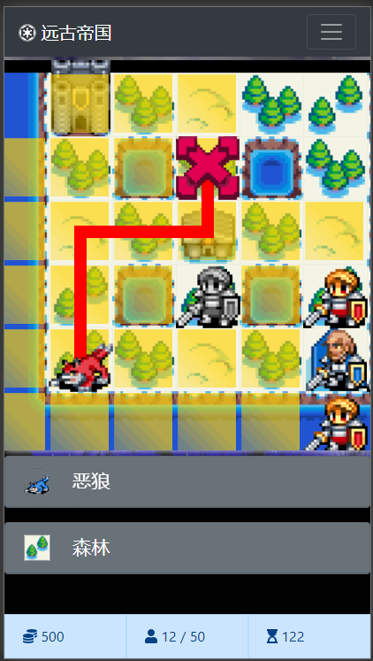
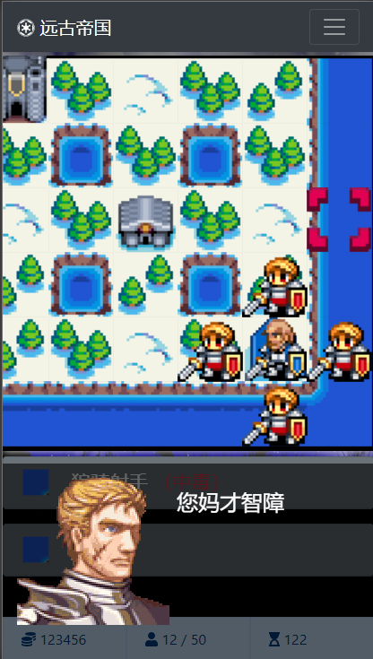
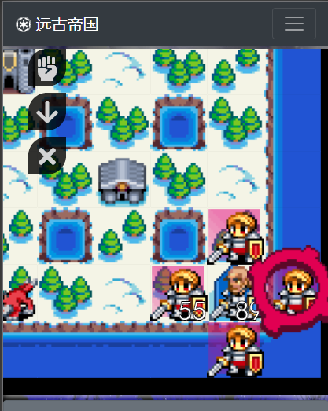
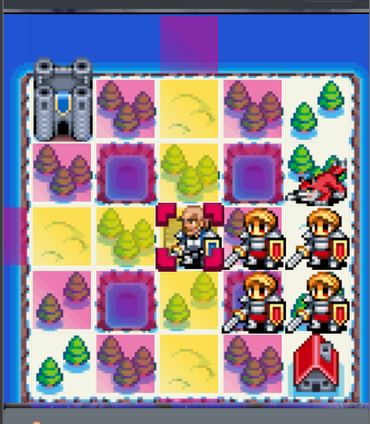

# 已废弃

+ 代码总量：约 2886 行
+ 2020.10.14 搁置，写恶心了，写之前规划不足，越写越混乱
+ 如果日后有机会用到本项目可能会继续或重构

## 效果图

## TODO

+ 功能选项
+ 模态弹窗：招募选项
+ 电脑自动控制战斗
+ 人物、地形特殊效果
+ 人物、地形描述说明

### 零碎功能

+ team 金币
+ 更多行动盘
+ 更多单位

## 日志

+ 2020.10.1

  + 基本地图精灵图切图

  + 正式开始开发

  + 选项动画完成

+ 2020.10.2

  + 弹窗完成

  + 基本游戏菜单

  + 加载层

  + 游戏面板布局

+ 2020.10.3

  + 地图绘制（该方案已废弃）

  + 缩放、偏移支持

+ 2020.10.4

  + 地图绘制

  + 拖拽监听函数（网页端、移动端兼容）

+ 2020.10.5

  + 主要图片基本准备完成

  + 实现绘制时变色

+ 2020.10.6

  + BUG fixed（玩了一天）

+ 2020.10.7

  + 人物数据准备、绘制（暴饮暴食废一天）

+ 2020.10.8

  + 点击坐标监听

  + 光标绘制

  + 点击事件发布订阅模型（模拟消息队列）

  + 剧情画面（功能区域）

+ 2020.10.9

  + 剧情功能

  + 增强事件分发中心自动控制功能

  + 底部信息区关联点击事件

  + 点击单元显示范围（BUG）

+ 2020.10.10

  + 范围显示

  + main.js 分割

  + 行动盘区域功能准备

+ 2020.10.11

  + 行动路径显示、移动动画

  + 单元行动前事件监听、订阅处理

  + DEBUG

+ 2020.10.12

  + 基本攻行动盘（攻击、占领、取消）

+ 2020.10.13 ~ 2020.10.14

  + 寻路（合法范围、行动路径、行动动画显示）

  + 模态弹窗（基本界面）

## BUG

[解决 BUG 期间写的文章: https://cxlm.work](https://cxlm.work/archives/js-canvas-4point)

+ drawImage 无效果： 需要图片对象完全加载（onload）后绘制才有效
+ 图像被拉伸： 画布的 width、height 属性要与 css 属性里设置的一致
+ 绘制出的地图中有较细的缝隙： 计算偏移时需要取整，绘图函数在处理浮点数时有问题
+ 拖拽监听：移动端与网页端函数、行为不同，通过实现 touch 相关方法实现
+ 变色后有部分颜色失真：在虚拟画布上等比绘制后变色，再绘制回虚拟画布，使用虚拟画布进行缩放绘制
+ 人物待机动画错位：切图问题，非代码 bug
